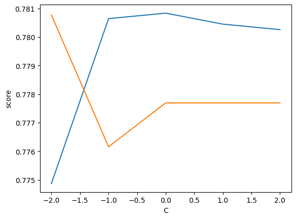
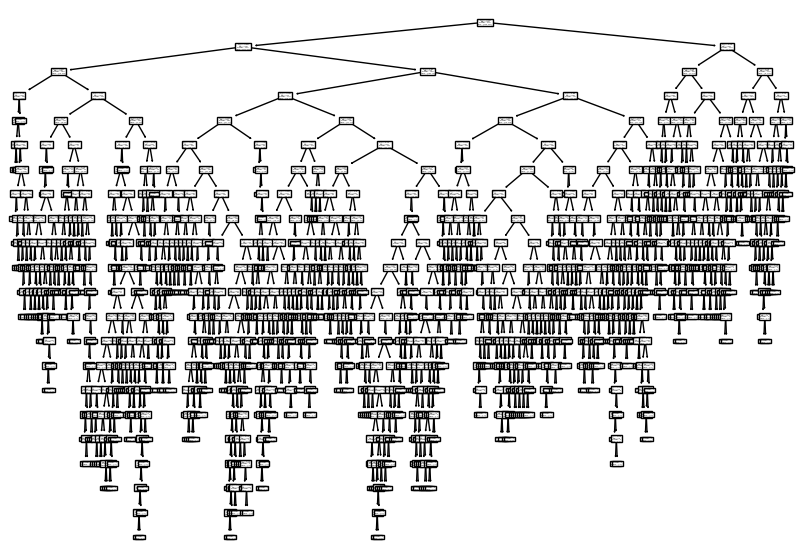
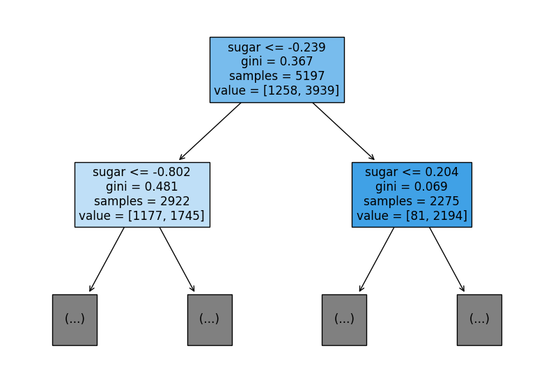
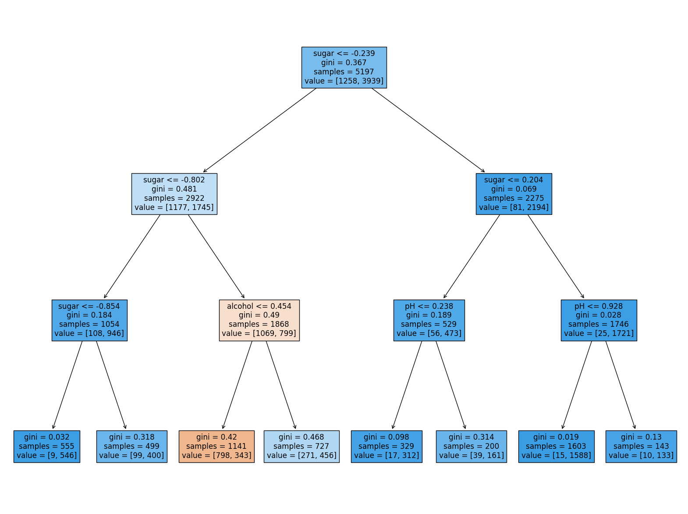

# Chapter 5-1 결정 트리 - 실습

## 0 . 소개

이번 글에서는 와인의 특성(알코올 도수, 당도, pH)을 이용해서 화이트 와인과 레드 와인을 분류하는 분류 문제를 해결해본다. 가장 먼저, 지난 시간 다룬 로지스틱 회귀를 이용해서 분류와 결과 해석을 해본 후 결정 트리 알고리즘을 이용해서 문제를 해결해본다. 그리고 가지치기로 과대적합 문제를 해결하고 특성 중요도를 통해 어떤 특성이 중요한지 확인해본다.


## 1. 로지스틱 회귀

먼저, 앞서 배운 분류 모델인 로지스틱 회귀 모델을 통해서 분류를 해본다.


### Step1. 데이터 불러오기 및 문제 정의하기


```python
# Load Data
import pandas as pd
wine = pd.read_csv('https://bit.ly/wine_csv_data')
wine.head()
```


<div>
<style scoped>
    .dataframe tbody tr th:only-of-type {
        vertical-align: middle;
    }

    .dataframe tbody tr th {
        vertical-align: top;
    }

    .dataframe thead th {
        text-align: right;
    }
</style>
<table border="1" class="dataframe">
  <thead>
    <tr style="text-align: right;">
      <th></th>
      <th>alcohol</th>
      <th>sugar</th>
      <th>pH</th>
      <th>class</th>
    </tr>
  </thead>
  <tbody>
    <tr>
      <th>0</th>
      <td>9.4</td>
      <td>1.9</td>
      <td>3.51</td>
      <td>0.0</td>
    </tr>
    <tr>
      <th>1</th>
      <td>9.8</td>
      <td>2.6</td>
      <td>3.20</td>
      <td>0.0</td>
    </tr>
    <tr>
      <th>2</th>
      <td>9.8</td>
      <td>2.3</td>
      <td>3.26</td>
      <td>0.0</td>
    </tr>
    <tr>
      <th>3</th>
      <td>9.8</td>
      <td>1.9</td>
      <td>3.16</td>
      <td>0.0</td>
    </tr>
    <tr>
      <th>4</th>
      <td>9.4</td>
      <td>1.9</td>
      <td>3.51</td>
      <td>0.0</td>
    </tr>
  </tbody>
</table>
</div>


위의 데이터프레임을 확인해보면 처음 3개의 열은 와인 샘플의 특성을 나타내며 다음과 같다.

|열 이름|특성|
|:--:|:--:|
|alcohol|알코올 도수|
|sugar|당도|
|pH|pH 농도|
|class|와인 종류(0=레드 와인, 1=화이트 와인)|

그렇다면 이번 문제를 정리하면 알코올 도수, 당도, pH 농도로 레드 와인(음성 클래스)과 화이트 와인(양성 클래스)을 구분하는 이진 분류 문제이다.

### Step2. 데이터 전처리

머신러닝 모델에 데이터를 확인하기 위해서 이번에는 다음을 확인한다.

1. 결측치 및 데이터 타입 확인하기 - info() 메서드
2. 스케일 확인하기 - describe() 메서드


```python
# Check missing value in data
wine.info()
```

    <class 'pandas.core.frame.DataFrame'>
    RangeIndex: 6497 entries, 0 to 6496
    Data columns (total 4 columns):
     #   Column   Non-Null Count  Dtype  
    ---  ------   --------------  -----  
     0   alcohol  6497 non-null   float64
     1   sugar    6497 non-null   float64
     2   pH       6497 non-null   float64
     3   class    6497 non-null   float64
    dtypes: float64(4)
    memory usage: 203.2 KB
    


```python
# Check statistic value from data
wine.describe()
```


<div>
<style scoped>
    .dataframe tbody tr th:only-of-type {
        vertical-align: middle;
    }

    .dataframe tbody tr th {
        vertical-align: top;
    }

    .dataframe thead th {
        text-align: right;
    }
</style>
<table border="1" class="dataframe">
  <thead>
    <tr style="text-align: right;">
      <th></th>
      <th>alcohol</th>
      <th>sugar</th>
      <th>pH</th>
      <th>class</th>
    </tr>
  </thead>
  <tbody>
    <tr>
      <th>count</th>
      <td>6497.000000</td>
      <td>6497.000000</td>
      <td>6497.000000</td>
      <td>6497.000000</td>
    </tr>
    <tr>
      <th>mean</th>
      <td>10.491801</td>
      <td>5.443235</td>
      <td>3.218501</td>
      <td>0.753886</td>
    </tr>
    <tr>
      <th>std</th>
      <td>1.192712</td>
      <td>4.757804</td>
      <td>0.160787</td>
      <td>0.430779</td>
    </tr>
    <tr>
      <th>min</th>
      <td>8.000000</td>
      <td>0.600000</td>
      <td>2.720000</td>
      <td>0.000000</td>
    </tr>
    <tr>
      <th>25%</th>
      <td>9.500000</td>
      <td>1.800000</td>
      <td>3.110000</td>
      <td>1.000000</td>
    </tr>
    <tr>
      <th>50%</th>
      <td>10.300000</td>
      <td>3.000000</td>
      <td>3.210000</td>
      <td>1.000000</td>
    </tr>
    <tr>
      <th>75%</th>
      <td>11.300000</td>
      <td>8.100000</td>
      <td>3.320000</td>
      <td>1.000000</td>
    </tr>
    <tr>
      <th>max</th>
      <td>14.900000</td>
      <td>65.800000</td>
      <td>4.010000</td>
      <td>1.000000</td>
    </tr>
  </tbody>
</table>
</div>


위의 메서드로 데이터에 대해서 확인해본 결과 결측치는 없지만, 당도의 값의 스케일이 알코올 도수와 pH 농도와 크게 다른 것을 확인할 수 있다. 로지스틱 회귀를 이용하기 위해서 데이터를 표준화하는 작업이 필요하다.

* 이번에는 데이터가 충분히 많으므로 테스트 세트를 20%로 설정한다.


```python
# split data to train/test and input/target
data = wine[['alcohol','sugar','pH']].to_numpy()
target = wine['class'].to_numpy()

from sklearn.model_selection import train_test_split
train_input, test_input, train_target, test_target = train_test_split(data, target, test_size=0.2, random_state=42)

# Check data shape
print(train_input.shape,test_input.shape)
```

    (5197, 3) (1300, 3)
    


```python
# Standardization
from sklearn.preprocessing import StandardScaler
ss = StandardScaler()
ss.fit(train_input)
train_scaled = ss.transform(train_input)
test_scaled = ss.transform(test_input)
```

### Step3. 모델 훈련


```python
# train model
from sklearn.linear_model import LogisticRegression
lr = LogisticRegression()
lr.fit(train_scaled, train_target)
```


    LogisticRegression()


```python
# evaluation
print(lr.score(train_scaled,train_target))
print(lr.score(test_scaled,test_target))
```

    0.7808350971714451
    0.7776923076923077
    

성능을 확인해보니 그렇게 결과가 그렇게 좋지 않다. 하이퍼파라미터를 조절해서 성능을 다시 높여보자. 로지스틱 회귀 모델의 규제 방식은 C값을 조절하는 것이었으므로 C 값을 조절해보자.


```python
# record score
train_score = []
test_score = []
C_list = [0.01, 0.1, 1, 10, 100]

for C in C_list:
    lr = LogisticRegression(C=C)
    lr.fit(train_scaled, train_target)
    train_score.append(lr.score(train_scaled,train_target))
    test_score.append(lr.score(test_scaled,test_target))

# graph
import matplotlib.pyplot as plt
import numpy as np

plt.plot(np.log10(C_list), train_score)
plt.plot(np.log10(C_list), test_score)
plt.xlabel('C')
plt.ylabel('score')
plt.show()
```


    

    


```python
# check coefficient
lr = LogisticRegression()
lr.fit(train_scaled, train_target)
print(lr.coef_, lr.intercept_)
```

    [[ 0.51270274  1.6733911  -0.68767781]] [1.81777902]
    

### Step4. 분석 결과

분석 결과 알코올 도수와 당도가 높을수록 pH 농도가 낮을수록 화이트 와인일 가능성이 높다는 것이다.

한계점으로는 로지스틱 회귀 모델을 사용한 결과 규제를 해도 성능이 좋아지지 않았으며, coef_와 intercept_ 속성으로 각 특성의 가중치의 의미를 경향성 정도만 알 수 있다는 것이다. 어떻게 저러한 가중치들을 학습했는지 설명하는 것은 어렵다. 

특성 공학을 이용해서 다항 특성을 사용하면 성능이 좋아질 수도 있지만 특성에 대해서 설명하기는 더욱더 어려워진다. 대부분의 머신러닝 모델 나아가 딥러닝 모델의 학습 결과를 설명하기란 쉽지 않다. 그렇다면 이유를 설명하기 쉬운 모델을 이용해보자.


## 2. 결정 트리

사이킷런에서 제공하는 **결정 트리(Decision Tree)** 모델은 tree 모듈 안에 있는 DecisionTreeClassifier 클래스를 사용해서 구현한다. 새로운 클래스이지만 사용법은 이전과 동일하게 fit()메서드로 훈련하고 score() 메서드로 정확도를 평가한다. 

> **매개변수**
DecissionTreeClassifier 클래스에서 노드의 데이터 분할 기준인 불순도는 criterion 매개변수로 설정하며, 기본값이 'gini'이다. certerion='entropy'를 지정하면 엔트로피 불순도를 사용할 수 있다.

* 사이킷런의 결정 트리 회귀 모델은 DecisionTreeRegressor이다.


### Step1. 모델 훈련


```python
# train model
from sklearn.tree import DecisionTreeClassifier
dt = DecisionTreeClassifier(random_state=42)
dt.fit(train_scaled, train_target)
```


    DecisionTreeClassifier(random_state=42)


```python
# evaluation
print(dt.score(train_scaled, train_target))
print(dt.score(test_scaled, test_target))
```

    0.996921300750433
    0.8592307692307692
    

정확도를 측정한 결과를 보니 정확도가 모두 올랐지만, 과적합된 것을 볼 수 있다.

이 모델을 그림으로 표현하는 방법은 plot_tree() 함수로 앞서 만든 결정 트리 모델 객체를 전달하는 것이다.


```python
# visualization
from sklearn.tree import plot_tree
plt.figure(figsize=(10,7))
plot_tree(dt)
plt.show()
```


    

    


조금 더 자세히 살펴보기 위해서는 plot_tree() 함수의 매개변수를 조절하면 된다. 다음의 3가지 매개변수를 조절하자.

1. max_depth : 깊이를 제한해서 일부를 출력해주는 매개변수
2. filled : 클래스에 맞게 노드에 색을 칠해주는 매개변수 
    * True로 지정하면 양성 클래스 비율이 높을수록 파란색에 가깝게 나타난다.
3. feature_names : 특성의 이름 전달하는 매개변수
    * 단, train_input으로 준 열의 순서로 전달해주어야 한다.


```python
# adjust parameters
plt.figure(figsize=(10,7))
plot_tree(dt, max_depth=1, filled=True, feature_names=['alcohol','sugar','pH'])
plt.show()
```


    

    


### Step2. 가지치기

과대적합된 트리 모델은 가지치기를 통해서 로지스틱 회귀의 규제와 같은 효과를 낼 수 있다. 가지치기는 DecisionTreeClasifier 클래스의 max_depth 매개변수를 조절해서 최대 깊이를 지정하는 것이다.


```python
# train model with pruning
dt = DecisionTreeClassifier(max_depth=3, random_state=42)
dt.fit(train_scaled, train_target)
```


    DecisionTreeClassifier(max_depth=3, random_state=42)


```python
# evaluation
print(dt.score(train_scaled, train_target))
print(dt.score(test_scaled, test_target))
```

    0.8454877814123533
    0.8415384615384616
    

훈련세트 성능이 떨어졌지만 과대적합은 해결되었다. 트리 그래프로 그려보자.


```python
plt.figure(figsize=(20,15))
plot_tree(dt, filled=True, feature_names=['alcohol','sugar','pH'])
plt.show()
```


    

    


### Step3. 표준화 전처리

결정 트리 모델의 장점 중 하나로 데이터를 표준화 전처리할 필요가 없다는 것이다. 이것을 확인하기 위해서 표준화 전처리하지 않은 데이터로 모델을 훈련하고 성능을 측정해보자.


```python
# train model with pruning
dt = DecisionTreeClassifier(max_depth=3, random_state=42)
dt.fit(train_input, train_target)
```


    DecisionTreeClassifier(max_depth=3, random_state=42)


```python
# evaluation
print(dt.score(train_input, train_target))
print(dt.score(test_input, test_target))
```

    0.8454877814123533
    0.8415384615384616
    

### Step4. 특성 중요도

결정 트리 모델의 또 다른 장점인 특성 중요도를 출력해보자. 특성 중요도는 결정 트리 모델의 feature_importances_ 속성에 저장되어 있다.


```python
print(dt.feature_importances_)
```

    [0.12345626 0.86862934 0.0079144 ]
    

로지스틱 회귀 모델에서 확인한 것처럼 두 번째 특성인 당도가 가장 중요한 특성임을 확인할 수 있다. 그러나, 로지스틱 회귀 모델과는 다르게 모든 특성 중요도를 합치면 1이 되는 것도 확인할 수 있다.


```python

```
